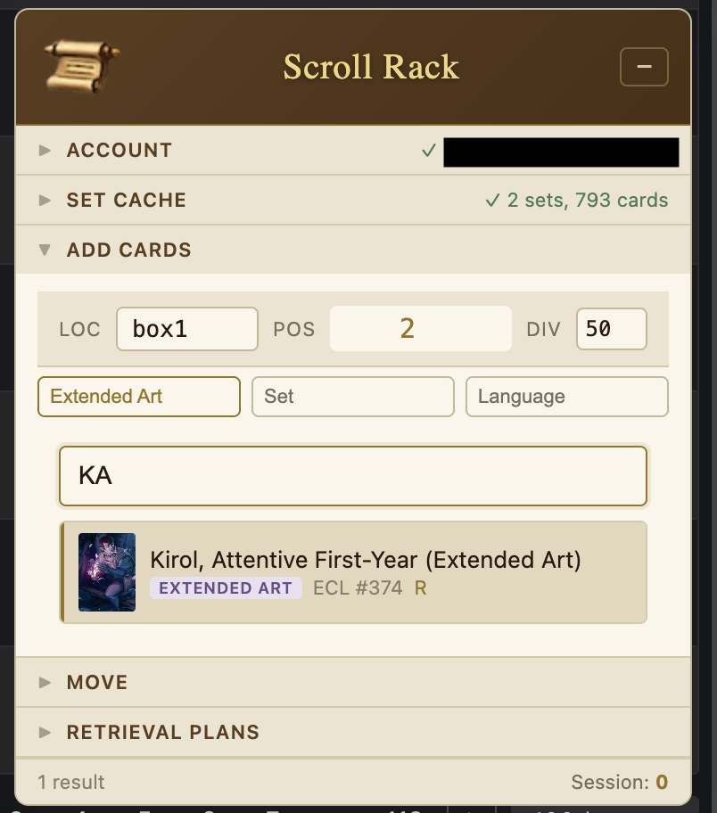
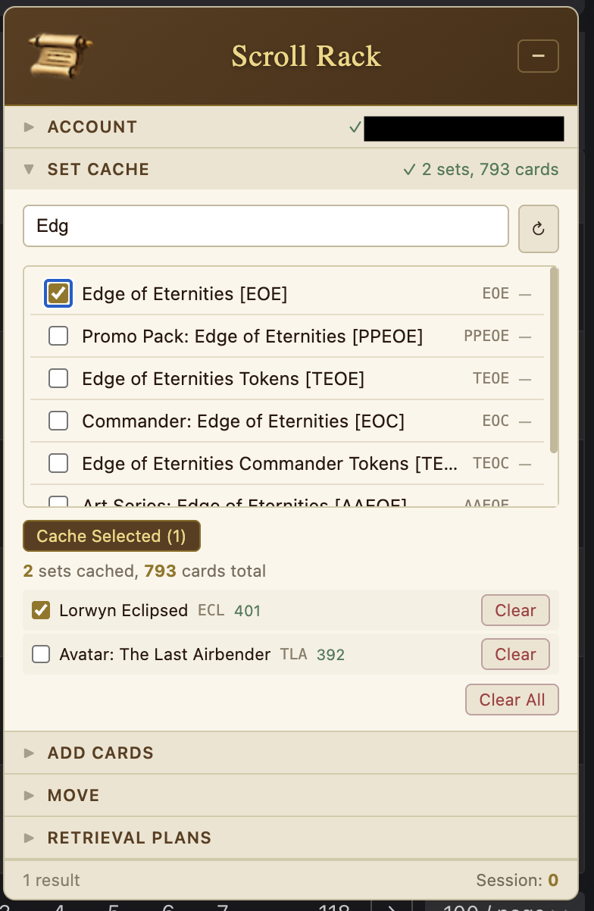
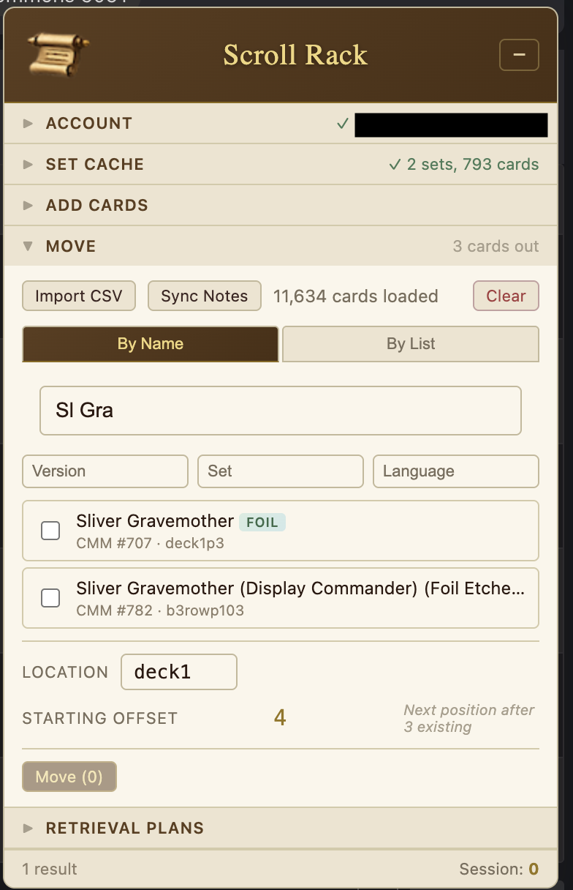
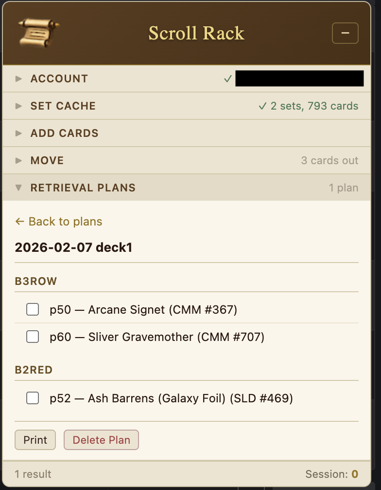

# Chrome Web Store Listing

## Name
Scroll Rack

## Short Description (132 chars max)
Connect your physical MTG card storage with EchoMTG. Track locations, add cards fast, and generate retrieval plans for deck building.

## Description

**Scroll Rack** helps Magic: The Gathering collectors manage their physical card storage by integrating with [EchoMTG](https://www.echomtg.com/). After installing the extension and navigating to the website, you'll be able to track your collection like never before through an overlay found towards the bottom right corner of the window.

You'll need to login through the the Account area so the extension can interact with your inventory - don't worry, all your info stays on your machine. This extension keeps _your_ info on _your_ machine and _your_ EchoMTG account.

### Key Features

- **Fast Card Entry**: Search cached sets and add cards to your EchoMTG inventory with a single keystroke. Physical location notes are automatically attached and stored remotely.

- **Focused Searching**: Instead of searching a remote database, key card details are cached locally for an efficient search.

- **Inventory Search**: Import your EchoMTG CSV and search by name, set, language, or card version (foil, borderless, etc.).

- **Retrieval Plans**: Building a deck? Generate a pick list organized by storage location so you can efficiently gather cards.

### How It Works

1. Log in with your EchoMTG account
2. Cache the sets you collect
3. Use the overlay to quickly add cards with location tracking
4. Import your full inventory to use the Move and Retrieval Plan features

### Permissions Explained

- **Storage**: Save your login session and cached card data locally
- **echomtg.com access**: Display the overlay on EchoMTG pages and sync with your inventory

### Privacy

All data stays on your device and your EchoMTG account. We don't collect analytics or share data with third parties. See our privacy policy for details.

---

*Built by a collector, for collectors.*

## Category
Just for Fun

## Language
English
